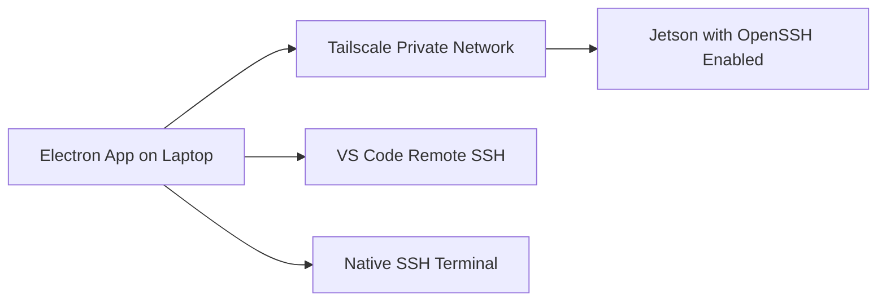

# PLSK Remote SSH Manager

PLSK Remote SSH Manager is a small Electron desktop app for connecting a laptop to an NVIDIA Jetson through Tailscale and SSH. It wraps the first remote-access workflow in a clear interface: check local tools, save a Jetson SSH address, test the connection, open a native SSH terminal, and open VS Code Remote SSH.

It does not include a Jetson agent, dashboard, camera monitoring, inference monitoring, cloud VM, reverse SSH, public IP setup, port forwarding, or multi-user authentication.

## What This Solves

The normal workflow is command-line based:

```bash
ssh min@plsk-jetson-001
code --remote ssh-remote+min@plsk-jetson-001 /home/min
```

This app makes that workflow easier to set up and repeat without hiding the underlying SSH and Tailscale model.

## Architecture



The laptop runs the Electron app. The Jetson runs Tailscale, OpenSSH server, and a normal Linux user account.

## Jetson Setup

First-time Tailscale users should read [docs/setup-guide.md](docs/setup-guide.md) before running setup. It covers signup, login, adding the laptop and Jetson to the same tailnet, and the current cost disclaimer.

Copy or clone this repository onto the Jetson, then run:

```bash
bash jetson/install-jetson-ssh.sh
sudo tailscale up
hostname
tailscale ip -4
sudo systemctl status ssh
```

After Tailscale login completes, note the username, hostname, or Tailscale IP. Example SSH addresses:

```text
min@plsk-jetson-001
min@100.x.x.x
plsk-jetson-001
```

## Laptop App Setup

Make sure the laptop is logged in to the same Tailscale account or organization as the Jetson.

Install Node.js, then install dependencies and start the app:

```bash
npm install
npm start
```

The app checks for:

- Tailscale
- SSH
- VS Code CLI

If the VS Code CLI is missing, open VS Code, press Cmd/Ctrl + Shift + P, and run:

```text
Shell Command: Install 'code' command in PATH
```

## Test Connection

Enter the Jetson SSH address and remote folder, then click **Save Device** and **Test Connection**.

The app runs:

```bash
ssh -o BatchMode=yes -o ConnectTimeout=5 <sshAddress> "echo connected"
```

## Open SSH Terminal

Click **Open SSH Terminal**. The app opens the native terminal for your platform and runs:

```bash
ssh <sshAddress>
```

## Open VS Code Remote SSH

Click **Open VS Code**. The app runs:

```bash
code --remote ssh-remote+<sshAddress> <remotePath>
```

## Troubleshooting

See [docs/troubleshooting.md](docs/troubleshooting.md).

Quick checks:

```bash
tailscale status
ssh min@plsk-jetson-001
code --version
```

## Security Notes

See [docs/security-notes.md](docs/security-notes.md).

In short: the app does not expose public SSH, does not store passwords, and does not give the renderer process unrestricted shell access.

## Tailscale Cost Disclaimer

Tailscale pricing can change. The setup guide includes a first-time account setup section and cost disclaimer. Check the official Tailscale pricing page before relying on this for budgeting: https://tailscale.com/pricing
